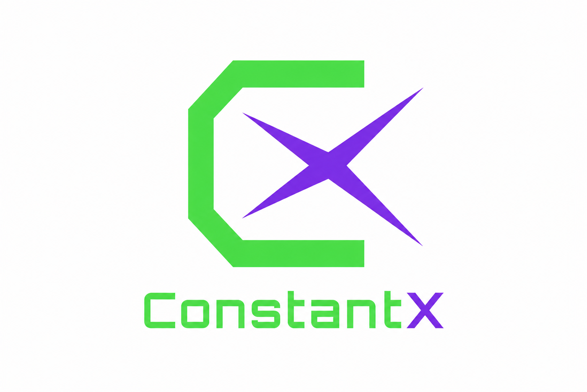
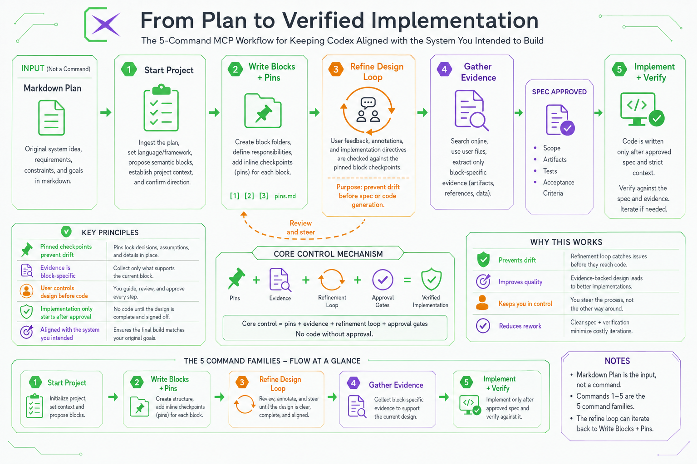

# ConstantX
<p align="center">
  
</p>
ConstantX is an opt-in MCP workflow for Codex. It turns a markdown system plan into traceable implementation blocks, gathers block-specific evidence, supports user-guided redesign before specs, and gates code implementation behind approved research, approved specs, and strict implementation context.

Use it from Codex only when your prompt starts like this:

```text
Use ConstantX. <workflow action>
```

## Documentation

- [Installation](docs/installation.md)
- [Codex Opt-In Setup](docs/codex-opt-in.md)
- [Project Layout](docs/project-layout.md)
- [Workflow Commands](docs/workflow-commands.md)
- [Shared Runtime And WSL2](docs/runtime-wsl2.md)
- [VS Code Extension](docs/vscode-extension.md)
- [Release Checklist](docs/release.md)
- [Block Design Sessions](docs/block-design-sessions.md)
- [Rules And Troubleshooting](docs/rules-and-troubleshooting.md)
- [MNIST Worked Example](docs/mnist-example.md)

## What It Does

- Decomposes a markdown plan into semantic implementation blocks from the actual plan, not generic phases.
- Stores each block as markdown artifacts for acceptance criteria, criteria diffs, evidence, pins, design sessions, directives, specs, and implementation records.
- Lets Codex gather broad evidence: papers, official docs, repositories, datasets, benchmarks, model cards, API docs, implementation examples, user files, and local project files.
- Creates original-plan acceptance criteria upfront, embeds them in each block, and pins them with inline `[n]` checkpoints backed by `criteria.md`, `criteria-diff.md`, and `pins.md`.
- Converts approved design decisions into implementation directives and concrete specs before implementation, with block refinement automatically recorded in `annotation-<BLOCK_ID>.md` and `design-session.md`.
- Preserves strict gates so implementation starts only after approved research, approved spec, dependencies, strict implementation context, criteria coverage evidence, and non-minimal implementation requirements.



## Quick Start

```bash
npm install
npm run build
```

Add the MCP server to Codex:

```json
{
  "mcpServers": {
    "ConstantX": {
      "command": "node",
      "args": ["<ABSOLUTE_PATH_TO_REPO>/dist/src/index.js"]
    }
  }
}
```

Then restart Codex.


## Runtime Execution

`workflow.implement` now creates persistent run/job records and can execute configured implementation and verification commands in a copied runtime workspace. WSL2 is the preferred v1 runtime, with distro detection across all installed WSL distros. If WSL2 is unavailable, ConstantX asks for explicit local-project fallback approval because it is less isolated.

See [Shared Runtime And WSL2](docs/runtime-wsl2.md) for config, HTTP MCP mode, logs, patches, and fallback behavior.
## Collaboration Context

ConstantX workflow commands accept optional collaboration context so audit logs, planner state, and graph output can show who performed each action and what scope was allowed.

```text
Actor: <NAME>
Role: owner | researcher | reviewer | implementer | verifier
Scope: project | B-001 | B-001, B-002 | artifact: <PATH>
Intent: <WHAT YOU ARE DOING>
Execution mode: review-only | draft | approve | implement | reimplement | verify-only
```

Example:

```text
Use ConstantX. Refine block B-001 in project <PROJECT_PATH>.

Actor: ayode
Role: owner
Scope: B-001
Intent: refine design before spec generation
Execution mode: review-only

I want to decide whether this block should use SAM 2 or Mask2Former.
Do not create the spec or implement yet.
```

If no actor is supplied, ConstantX records the action as `local-user` for backward compatibility. Role and scope gates reject invalid write actions where collaboration context is provided. See [Multi-User Collaboration Provenance](docs/multi-user-collaboration-plan.md).

## Main Prompt Shape

```text
Use ConstantX. Start project <PROJECT_PATH> from plan <PLAN_MARKDOWN_PATH> with language <LANGUAGE> and framework <FRAMEWORK>. Propose no more than <MAX_BLOCKS> blocks. Do not write blocks until I approve.
```

Continue with the five command families in [Workflow Commands](docs/workflow-commands.md). Use [Block Design Sessions](docs/block-design-sessions.md) for the refinement loop before `spec.md` is finalized.


