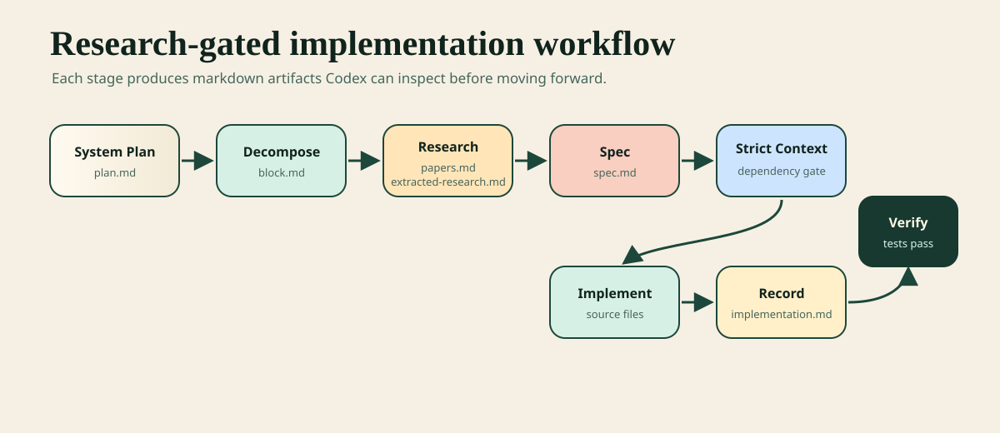
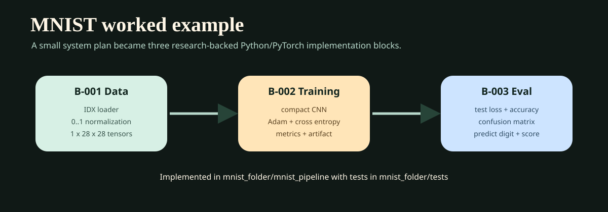

# deep_learning_auto_research

`deep_learning_auto_research` is an opt-in MCP workflow for Codex. It turns a markdown system plan into traceable implementation blocks, attaches research papers to each block, extracts block-specific evidence, creates implementation specs, and gates coding behind approved context.

This is not a terminal CLI. You run the MCP server, then ask Codex to use it with prompts like:

```text
Use deep_learning_auto_research. <workflow action>
```

Codex does the reasoning, research, extraction, and implementation work. The MCP server stores workflow state and markdown artifacts.


## Visual Overview



## What It Creates

For each planner project, the tool creates a markdown-first structure:

```text
<PROJECT_PATH>/
  .planner/
    state.json
    graph.json
    audit-log.jsonl
  blocks/
    B-001-.../
      block.md
      papers.md
      extracted-research.md
      spec.md
      implementation.md
  papers/
  graph.md
  system-plan.md
```

Each block is an actual part of the source plan, not a generic phase like foundation or deployment.

## Installation

Prerequisites:

- Node.js
- npm
- Codex with MCP server support

Install dependencies and build the server:

```bash
npm install
npm run build
```

The MCP server entrypoint is:

```bash
node dist/src/index.js
```

## Codex MCP Configuration

Add the built server to your Codex MCP config. Use the underscore key so the workflow is exposed as `deep_learning_auto_research`.

```json
{
  "mcpServers": {
    "deep_learning_auto_research": {
      "command": "node",
      "args": ["<ABSOLUTE_PATH_TO_REPO>/dist/src/index.js"]
    }
  }
}
```

After editing the MCP config, restart Codex. Existing sessions may keep the old tool schema until restart.

## Recommended Codex Instructions

Add only the opt-in rule to your global `AGENTS.md`:

```md
[Tools]

deep_learning_auto_research is opt-in only.

Use the deep_learning_auto_research MCP server only when I explicitly ask with a prompt that starts with or clearly includes "Use deep_learning_auto_research" or "Use the deep_learning_auto_research MCP workflow".

Do not use deep_learning_auto_research automatically for normal coding, debugging, editing, explanation, refactoring, terminal, or research tasks.

When deep_learning_auto_research is invoked, follow the requested MCP stage exactly and do not advance to another stage unless I ask.
```

## Workflow

1. Create a planner project.
2. Ingest the markdown system plan.
3. Decompose the plan into semantic implementation blocks.
4. Review and approve the proposed blocks.
5. Set the implementation target, for example `Python` and `PyTorch`.
6. Prepare research context for a block.
7. Search online or attach user-provided papers.
8. Extract only block-specific research.
9. Approve extracted research.
10. Create `spec.md` from `block.md`, `papers.md`, and `extracted-research.md`.
11. Approve `spec.md`.
12. Prepare strict implementation context.
13. Let Codex implement only that block.
14. Record the implementation.
15. Verify the block.
16. Prepare final code synthesis context after all blocks are implemented or verified.

Strict implementation context is the gate that prevents Codex from implementing too early.

## Prompt Templates

Replace placeholders like `<PROJECT_PATH>`, `<PLAN_MARKDOWN_PATH>`, `<BLOCK_ID>`, `<LANGUAGE>`, and `<FRAMEWORK>`.

### Project Setup

```text
Use deep_learning_auto_research. Create a planner project at <PROJECT_PATH>.
```

```text
Use deep_learning_auto_research. Ingest <PLAN_MARKDOWN_PATH> into project <PROJECT_PATH> as <PLAN_FILE_NAME>.
```

```text
Use deep_learning_auto_research. Read the plan in project <PROJECT_PATH>. Do not use automatic decomposition directly. Reason over <PLAN_FILE_NAME> and propose no more than <MAX_BLOCKS> semantic implementation blocks. Show me the proposed blocks before writing them.
```

```text
Use deep_learning_auto_research. Write the approved proposed blocks to project <PROJECT_PATH> by calling planner.decompose_plan with the blocks I approved.
```

```text
Use deep_learning_auto_research. List all blocks in project <PROJECT_PATH>.
```
### Implementation Target

Set this before specs or implementation so Codex does not guess the language/framework from the MCP repo itself.

```text
Use deep_learning_auto_research. Set implementation target for project <PROJECT_PATH> to language <LANGUAGE> and framework <FRAMEWORK>. Do not implement.
```

```text
Use deep_learning_auto_research. Read the implementation target for project <PROJECT_PATH>.
```

### Research

Ask Codex to search online for primary sources:

```text
Use deep_learning_auto_research. Prepare online research context for <BLOCK_ID> in project <PROJECT_PATH>. Search for relevant primary papers, add the useful ones as paper references, then extract only <BLOCK_ID>-specific research. Do not implement yet.
```

Attach your own paper:

```text
Use deep_learning_auto_research. Attach my paper <PAPER_PATH> to <BLOCK_ID> in project <PROJECT_PATH> with title "<PAPER_TITLE>" and citation "<PAPER_CITATION>". Do not implement.
```

Review a block package:

```text
Use deep_learning_auto_research. Read block <BLOCK_ID> in project <PROJECT_PATH> so I can review block.md, papers.md, and extracted-research.md. Do not implement.
```

Approve extracted research:

```text
Use deep_learning_auto_research. Approve extracted research for <BLOCK_ID> in project <PROJECT_PATH> with reviewer <REVIEWER_NAME>.
```

### Spec

```text
Use deep_learning_auto_research. Create spec.md for <BLOCK_ID> in project <PROJECT_PATH> from block.md, papers.md, extracted-research.md, and the approved implementation target. Do not implement yet.
```

```text
Use deep_learning_auto_research. Read block <BLOCK_ID> in project <PROJECT_PATH> so I can review spec.md. Do not implement.
```

```text
Use deep_learning_auto_research. Approve spec.md for <BLOCK_ID> in project <PROJECT_PATH> with reviewer <REVIEWER_NAME>.
```

### Implementation

```text
Use deep_learning_auto_research. List ready blocks in project <PROJECT_PATH>.
```

```text
Use deep_learning_auto_research. Prepare strict implementation context for <BLOCK_ID> in project <PROJECT_PATH>, then implement only <BLOCK_ID> from the approved spec.
```

Use reimplementation mode only when you explicitly want to redo a block that is already `implemented` or `verified`:

```text
Use deep_learning_auto_research. Prepare strict implementation context for <BLOCK_ID> in project <PROJECT_PATH> with mode reimplement, then reimplement only <BLOCK_ID> from the approved spec.
```

Record the implementation after Codex finishes coding:

```text
Use deep_learning_auto_research. Record the implementation for <BLOCK_ID> in project <PROJECT_PATH> with summary "<IMPLEMENTATION_SUMMARY>" and changed files <CHANGED_FILES>.
```

Verify the block:

```text
Use deep_learning_auto_research. Verify <BLOCK_ID> in project <PROJECT_PATH> with verifier <VERIFIER_NAME> and evidence "<TEST_OR_BUILD_EVIDENCE>".
```

### Final Code Synthesis

```text
Use deep_learning_auto_research. Prepare final code context for project <PROJECT_PATH> in strict mode after all blocks are implemented or verified.
```

## Rules And Guarantees

- The workflow is opt-in. Codex should only use it when you explicitly say `Use deep_learning_auto_research`.
- Blocks should be derived from the actual plan, not generic implementation phases.
- Research extraction should be block-specific, not broad paper summaries.
- Specs should be created only after research approval.
- Implementation should happen only after strict implementation context succeeds.
- Dependencies must be implemented or verified before dependent blocks can be implemented.
- `mode reimplement` allows redoing implemented or verified blocks, but it does not bypass strict gates.
- The implementation target must be explicit: language plus framework.

## Troubleshooting

- If Codex does not see `deep_learning_auto_research`, rebuild the server and restart Codex.
- If a new tool argument does not appear, restart Codex so the MCP schema refreshes.
- If a block is not ready to implement, check research approval, spec approval, and dependency status.
- If strict implementation context says `spec.md` is missing the implementation target, recreate the spec or add the target section.
- On Windows, quote paths with spaces.
- Use the project directory as `<PROJECT_PATH>`, not the path to the plan file.

Example Windows path:

```text
"C:\Users\<YOU>\New folder (3)\my_project"
```
## MNIST Worked Example



This repo includes a complete example in [`mnist_folder`](mnist_folder). It demonstrates the full workflow for a Python/PyTorch MNIST classifier.

Final project path:

```text
C:\Users\ayode\New folder (3)\mnist_folder
```

If you renamed the parent folder, use the current folder path and keep `\mnist_folder` at the end.

### Example Stage Map

The MNIST project produced these blocks:

- [`B-001 Data Pipeline and Preprocessing`](mnist_folder/blocks/B-001-data-pipeline-and-preprocessing/block.md)
- [`B-002 CNN Model Training`](mnist_folder/blocks/B-002-cnn-model-training/block.md)
- [`B-003 Evaluation, Inference, and Run Instructions`](mnist_folder/blocks/B-003-evaluation-inference-and-run-instructions/block.md)

Research and specs:

- [`B-001 papers.md`](mnist_folder/blocks/B-001-data-pipeline-and-preprocessing/papers.md)
- [`B-001 extracted-research.md`](mnist_folder/blocks/B-001-data-pipeline-and-preprocessing/extracted-research.md)
- [`B-001 spec.md`](mnist_folder/blocks/B-001-data-pipeline-and-preprocessing/spec.md)
- [`B-002 papers.md`](mnist_folder/blocks/B-002-cnn-model-training/papers.md)
- [`B-002 extracted-research.md`](mnist_folder/blocks/B-002-cnn-model-training/extracted-research.md)
- [`B-002 spec.md`](mnist_folder/blocks/B-002-cnn-model-training/spec.md)
- [`B-003 papers.md`](mnist_folder/blocks/B-003-evaluation-inference-and-run-instructions/papers.md)
- [`B-003 extracted-research.md`](mnist_folder/blocks/B-003-evaluation-inference-and-run-instructions/extracted-research.md)
- [`B-003 spec.md`](mnist_folder/blocks/B-003-evaluation-inference-and-run-instructions/spec.md)

Implementation files:

- [`mnist_pipeline/data.py`](mnist_folder/mnist_pipeline/data.py)
- [`mnist_pipeline/model.py`](mnist_folder/mnist_pipeline/model.py)
- [`mnist_pipeline/evaluation.py`](mnist_folder/mnist_pipeline/evaluation.py)
- [`mnist_pipeline/RUN_INSTRUCTIONS.md`](mnist_folder/mnist_pipeline/RUN_INSTRUCTIONS.md)
- [`tests/test_mnist_pipeline.py`](mnist_folder/tests/test_mnist_pipeline.py)
- [`tests/test_mnist_model.py`](mnist_folder/tests/test_mnist_model.py)
- [`tests/test_mnist_evaluation.py`](mnist_folder/tests/test_mnist_evaluation.py)

### Main Prompts Used

Create and ingest:

```text
Use deep_learning_auto_research. Create a planner project at "C:\Users\ayode\New folder (3)"
```

```text
Use deep_learning_auto_research. Ingest C:\Users\ayode\New folder (3)\mnist.md into project C:\Users\ayode\New folder (3) as mnist.
```

Decompose:

```text
Use deep_learning_auto_research. Read the plan in project C:\Users\ayode\New folder (3). Do not use automatic decomposition directly. Reason over mnist.md and propose no more than 3 semantic implementation blocks. Show me the proposed blocks before writing them.
```

```text
Use deep_learning_auto_research. Write the approved proposed blocks to project C:\Users\ayode\New folder (3) by calling planner.decompose_plan with the blocks I approved.
```

Set implementation target:

```text
Use deep_learning_auto_research. Set implementation target for project C:\Users\ayode\New folder (3) to language Python and framework PyTorch. Do not implement.
```

Research each block:

```text
Use deep_learning_auto_research. Prepare online research context for B-001 in project C:\Users\ayode\New folder (3). Search for relevant primary papers, add the useful ones as paper references, then extract only B-001-specific research. Do not implement yet.
```

```text
Use deep_learning_auto_research. Prepare online research context for B-002 in project C:\Users\ayode\New folder (3). Search for relevant primary papers, add the useful ones as paper references, then extract only B-002-specific research. Do not implement yet.
```

```text
Use deep_learning_auto_research. Prepare online research context for B-003 in project C:\Users\ayode\New folder (3). Search for relevant primary papers, add the useful ones as paper references, then extract only B-003-specific research. Do not implement yet.
```

Approve research and specs:

```text
Use deep_learning_auto_research. Approve extracted research for <BLOCK_ID> in project C:\Users\ayode\New folder (3) with reviewer fikayo.
```

```text
Use deep_learning_auto_research. Create spec.md for <BLOCK_ID> in project C:\Users\ayode\New folder (3) from block.md, papers.md, and extracted-research.md. Do not implement yet.
```

```text
Use deep_learning_auto_research. Approve spec.md for <BLOCK_ID> in project C:\Users\ayode\New folder (3) with reviewer fikayo.
```

Implement blocks:

```text
Use deep_learning_auto_research. Prepare strict implementation context for B-001 in project C:\Users\ayode\New folder (3) with mode reimplement, then reimplement only B-001 from the approved spec.
```

```text
Use deep_learning_auto_research. Prepare strict implementation context for B-002 in project C:\Users\ayode\New folder (3) with mode reimplement, then reimplement only B-002 from the approved spec.
```

```text
Use deep_learning_auto_research. Prepare strict implementation context for B-003 in project C:\Users\ayode\New folder (3) with mode reimplement, then reimplement only B-003 from the approved spec.
```

Move the finished project into its own folder:

```text
i want you to move all of the mnist pipline including blocks etc and implementations into a folder called mnist_folder in this same pratent folder
```

After the move, use this project path for future MCP prompts:

```text
<REPO_PATH>\mnist_folder
```

Verify the example:

```bash
python -m unittest discover -s mnist_folder\tests -t mnist_folder -p "test_*.py"
npm run build
npm test
```


