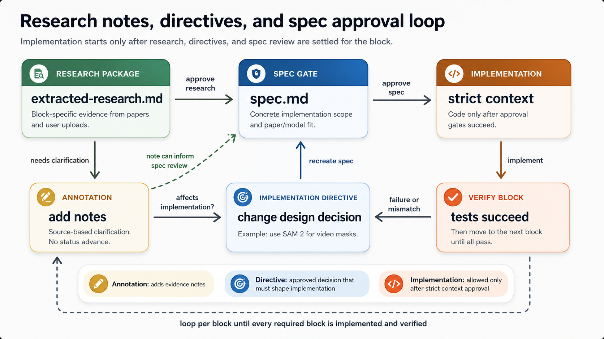

# Block Design Sessions

Design sessions let the user redesign a block before `spec.md` is generated without manually managing pins, stages, or repeated annotation commands.

## Start A Session

```text
Use deep_learning_auto_research. Start a block design session for <BLOCK_ID> in project <PROJECT_PATH>. Generate internal pins from the original plan, block.md, papers.md, extracted-research.md, directives.md, and spec.md so we can redesign this block before spec generation. Do not approve, create specs, or implement.
```

The MCP server generates `pins.md`, `design-session.md`, and `annotation-<BLOCK_ID>.md` inside the block folder.

## Discuss Normally

During the discussion, you can speak normally. Codex should compare your requested changes against the generated pins, block scope, extracted evidence, and existing directives, then internally call `workflow.record_block_design_turn` to update `annotation-<BLOCK_ID>.md` and `design-session.md`.

You do not need to manage pin ids or send repeated annotation commands.

## Finalize The Session

```text
Use deep_learning_auto_research. Finalize the block design session for <BLOCK_ID> in project <PROJECT_PATH>. Convert approved decisions into implementation directives, approve research if ready, create spec.md, and show it for review. Do not approve spec or implement.
```

The generated `spec.md` must cite finalized design pins, approved directives, implementation target, evidence/model fit, exact files/artifacts to create or modify, artifacts to remove or replace, non-goals, acceptance criteria, verification plan, and traceability.


